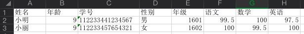

# zyb_java_excel_reader

## 1. create excel file



## 2. create java object
```
    @FormatClass
    public class Student {
        @FormatField("姓名")
        public String name;
        @FormatField("年龄")
        public int age;
        @FormatField("学号")
        public String studentNo;
        @FormatField("性别")
        public String sex;
        @FormatField("年级")
        public String grade;
        @FormatField("语文")
        public double langScore;
        @FormatField("数学")
        public double mathScore;
        @FormatField("英语")
        public double englishScore;
    }
```

##  3. read obj from file
```
    ExcelReader<Student> reader  = new ExcelReader<>();
    reader.open(new File(filePath), Student.class);
    Student student = reader.nextObject();
```

## 4. result
```
Read xml , line :  1 : {"age":9,"englishScore":97.5,"grade":"1601","langScore":99.5,"mathScore":100.0,"name":"小明","sex":"男","studentNo":"112233441234567"}
Read xml , line :  2 : {"age":9,"englishScore":100.0,"grade":"1602","langScore":100.0,"mathScore":99.5,"name":"小丽","sex":"女","studentNo":"112233457654321"}
```
